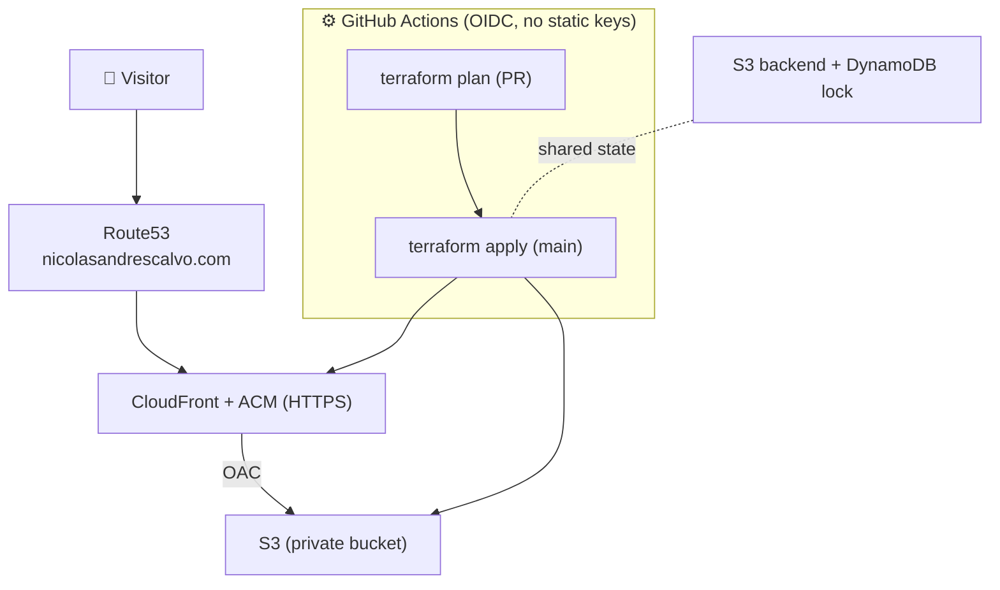

# ☁️ portfolio-infra

The AWS infrastructure for my portfolio site, as Terraform. It hosts
[`portfolio-web`](https://github.com/NicolasAndresCalvo/portfolio-web), and the pipeline is
the only thing that applies it.

## 🗺️ The architecture (and index)



Phase 1 (current) is just the `S3` box. Phase 2 adds `CloudFront`, `ACM` and `Route53`.

## 🧭 In plain terms

The site is static files in a bucket. A CDN puts them behind HTTPS and my domain. Nobody
runs `terraform apply` by hand: I open a PR, the pipeline shows the plan, and merging to
`main` applies it, authenticating to AWS with a short-lived OIDC role (no stored keys).

## 🧱 Phases

| Phase | What | Status |
|-------|------|--------|
| 1 | S3 static website (HTTP, no domain) | ✅ live |
| 2 | CloudFront + ACM + Route53 (HTTPS + domain), bucket private behind OAC | ⏳ next |

See [`docs/roadmap.md`](./docs/roadmap.md) for the full phase-2 checklist.

## 🧩 What's inside

| Path | What |
|------|------|
| `*.tf` | the live infrastructure (S3 today, CloudFront/ACM/Route53 next) |
| `bootstrap/` | one-time, local: state backend + GitHub OIDC provider + CI roles |
| `.github/workflows/terraform.yml` | CI: fmt/validate/plan on PR, apply on `main` |
| `docs/roadmap.md` | phase-2 plan |

## 🚀 Workflow (GitOps)

```bash
# 1. change a .tf on a branch, open a PR  → CI runs `terraform plan`
# 2. merge to main                        → CI runs `terraform apply` (OIDC)
```

The one exception is `bootstrap/`: it creates the very state backend and roles the pipeline
needs, so it is applied once, locally, with the `min` AWS profile. Everything else is the pipeline.

## 🔒 Public repo hygiene

No `*.tfstate`, no `*.tfvars`, no credentials, no account ids in code. State lives in the
encrypted S3 backend; everything else is variables.
